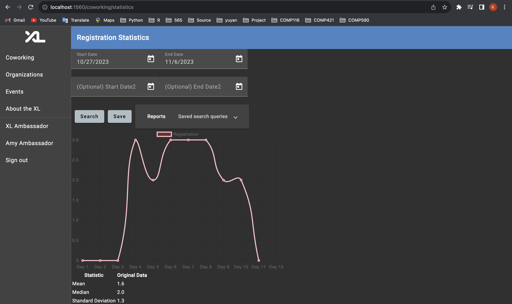
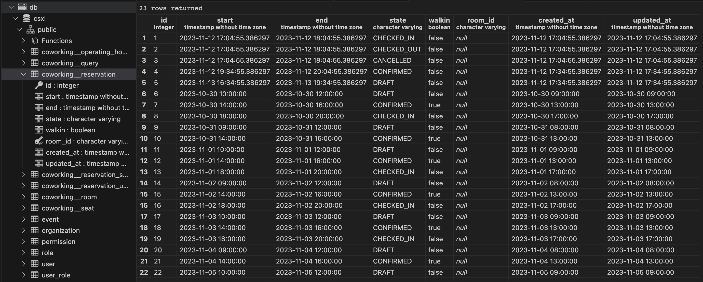
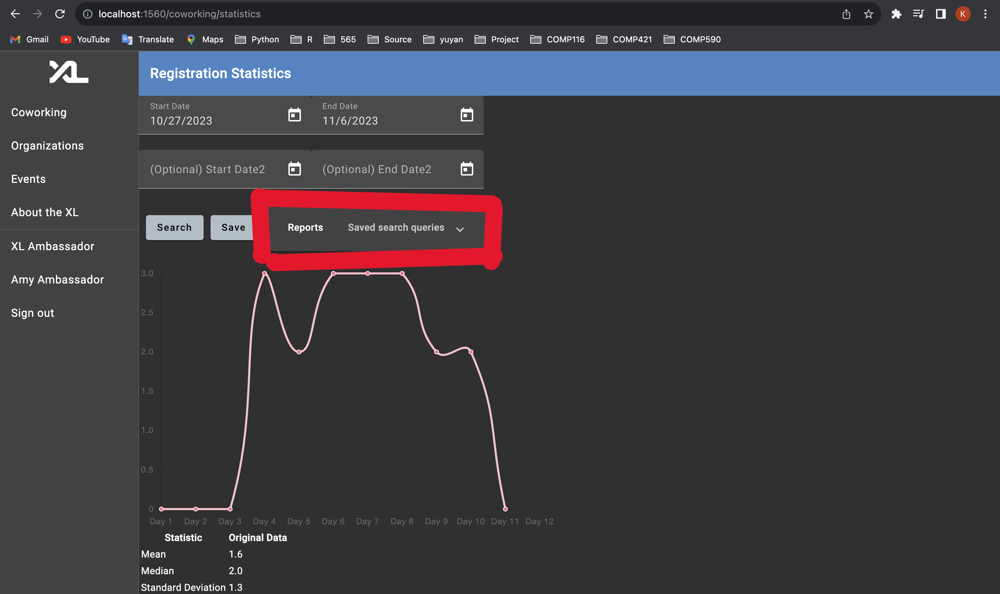
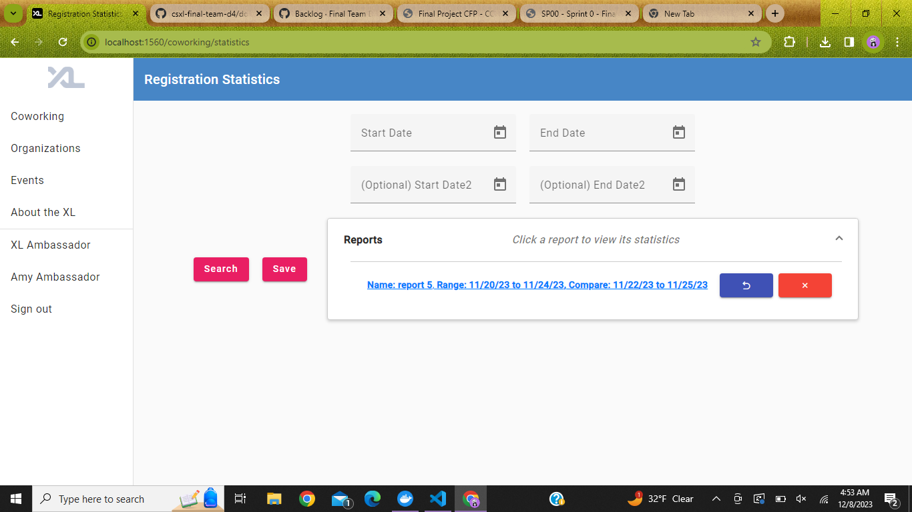
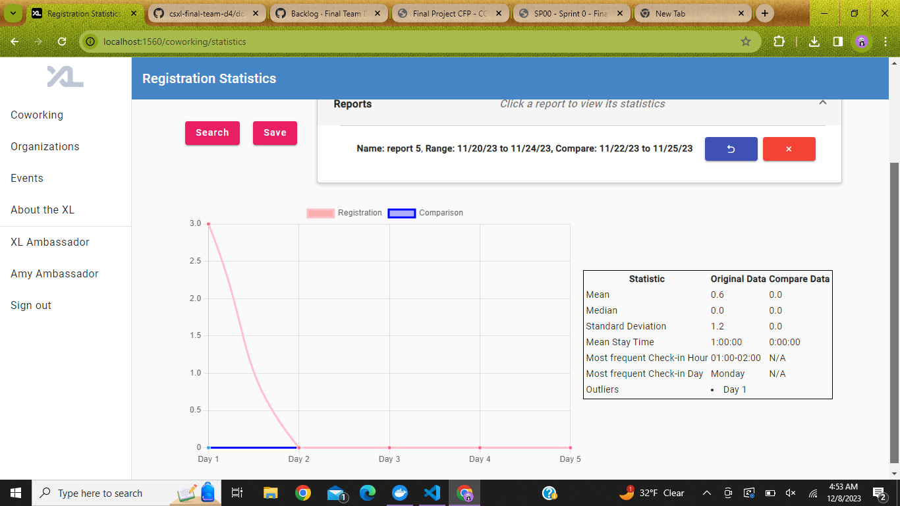
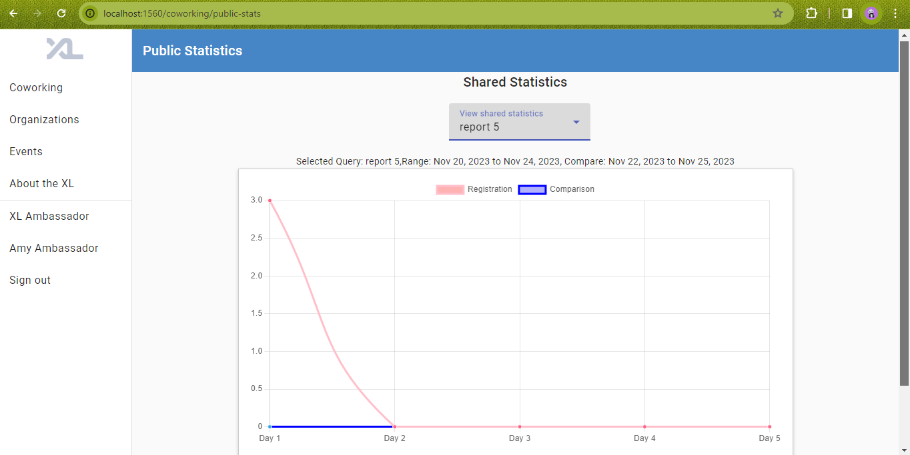
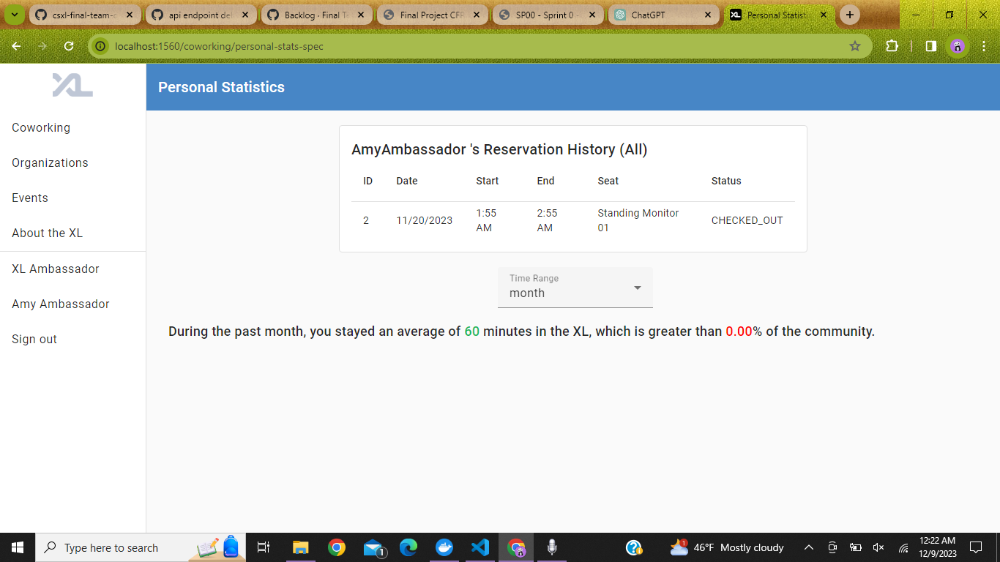

# Technical Specification Documentation

## Story 1

### 1. New model representation(s) and API routes

In this story, we created a new functionality called "Statistics", with corresponding api route "/statistics/get-daily". Which looks like the image below.

Our statistic function takes in the start and end dates, and returns a plotted graph of all the reservation counts for each day. For better visualization, a line passes through the points to better show the change in daily reservation changes.
The data is fetched directly from our given database and calculated for the frontend display.
Sample data: our testing data in the local database is attached below.

### 2. Description of underlying database/entity-level representation decisions

We implemented our feature by extending on the given reservation data. We decided not to create a new table for Story1 because the timeframe for one single graph is short, making it unnecessary to add to a new table. We calculated the number of data of each day during the period and directly plot to the graph.

However, for story2, we would let user decide which report are expected as common viewed, so the user can click save and we would then store it to the database called query.

### 3. Technical and user experience design choice

Technical choice: we decided between creating a new service method and extending on the given registration method. We chose to implement the existing registration service because after a code review, we realized that many given helper function in the registration service are useful for our new functionality. Therefore we decided to add a new method to the registration service.

Design choice: When considering the display of the statistics, we debated between using a line chart or a bar plot. We decided to use a line plot for easier visualization, and making it more straight forward when coming to comparson between the two different time ranges.

We made another choice on where to put the link to the statistics page. We had two options of either putting it on the side bar or displaying it under ambassador reservation history page. We decided to go with the second one, in order to prevent users with other authority to be able to view the data. This also keeps the side bar clean.

### 4. Development concern

Our feature basically takes two time frames: the start date and end date, and plot the number of reservations each day to the line graph to get a visualization of what the data during the period is like. People can choose to add a comparison timeframe to generate another line graph of a different color. The algorithm is straight forward, with taking the timeframe and break down into each day. For every day, we count the number of reservations and store into a dictionary. Then, we plot the data in the dictionary to the graph.

One major concern is for people to understand about the angular material package. We used the datepicker from this to be able to analyze the date and plot to the chart. Moreover, we imported displaying chart functionality from chart.js to pass in the plotted values and set the display chart to true to turn on the visual.

## Story 2

### 1. New model representation(s) and API routes

In this story, we created a new feature called "Reports" where we saved previously searched time ranges and made them easily accessible again. There is one more new API route here for deletion of a saved query which is "/api/admin/queries/delete_query/${query.name}". We also created a new frontend model named "Query".

### 2. Description of underlying database/entity-level representation decisions

We decided to create a new database table for Story2 because having multiple saved queries was going to require storage. We calculated and saved the number of hours spent in the XL each day during the given timeframes into a POSTGRES database for easy retrieval at a later point. We also created a new entity named "Query" that stores all the information we used to search dates which will be useful as we save reports.

### 3. Technical and user experience design choice

Technical choice: we decided to save our queries in a backend table to make our frontend report retriveal much more convenient.

Design choice: We decided to use an angular component for the report dropdown for consistency and looks. There are also embedded share and delete buttons, for this sprint/story we only implemented the delete button

### 4. Development concern

The only development concern moving forward from here was how we were going to implement the publicly available reports since there will need to be authentication and some sort of share feature made to handle this.

## Story 3

### 1. New model representation(s) and API routes

In this story, we created a new feature for sharing reports to the public which involved creating new API routes "/coworking/public-stats" for viewing public statistics and "/api/admin/queries/update_share/${query.name}" for sharing statistics from an ambassador's point of view. This feature replicated much of the same functionality as our main statistics page, as can be seen in our new public-stats component.

### 2. Description of underlying database/entity-level representation decisions

In the backend, we mainly made a new API route and methods for getting shared queries and did not add much in terms of entities or database values.

### 3. Technical and user experience design choice

Technical choice: there was a bit of trouble deciding whether to use an API route using admin or coworking but we ultimately decided on coworking since it was the more functional route to use.

Design choice: When considering whether we should create a separate page for shared statistics, we once again thought about how the sidebar would look with another item. In the end we once again chose to opt for not adding a new item to the sidebar and instead making a path to see shared statistics from a user's xl profile page.

### 4. Development concern

Our biggest concern for this story was the convenience factor for students to find any shared statistics. Another aspect that led to our decision of not making an entirely new page for statistics was the possibility of having personal statistics if we decided to go through with the last stretch goal, having statistics viewable in up to 3 places seemed messy so after deciding that we would do the last story we also decided to have a path leading to shared statistics which may also lead to personal statistics.

## Story 4

### 1. New model representation(s) and API routes

In this story, we created a new function for students to view their own personal xl lab statistics.

A new component named personal-stats-spec was created for this feature as well as a new API route "/coworking/personal-stats-spec" for viewing personal statistics separately.

### 2. Description of underlying database/entity-level representation decisions

In the backend, we created the API route "/statistics/get_personal_statistical_history" for getting the correct database information to present in our frontend personal stats widget.

### 3. Technical and user experience design choice

Technical choice: We decided to make the personal statistics a table of information instead of just a line graph since when dealing with one person's reservation history in the xl we are more likely to see 0s and 1s over the course of a week and this data does not make for a very interesting or insightful graph. This new table widget allows students to see their reservation exact reservation data, including date, start/end times, seat information, and current xl lab status. The id column is also included for extra differentiation of multiple checkins.

Design choice: We decided to make a separate page for viewing personal statistics to give a user a sense of more personalized and secure feedback while viewing their statistics. We also made a new line of insightful information that tells a student how often they are checking in, in comparison to other students.

### 4. Development concern

Our only development concern with this feature was the including the extra step of navigating to another page to view personal statistics. However, we believed that having this extra page was necessary and it is likely worth the bit of extra effort of navigation.
